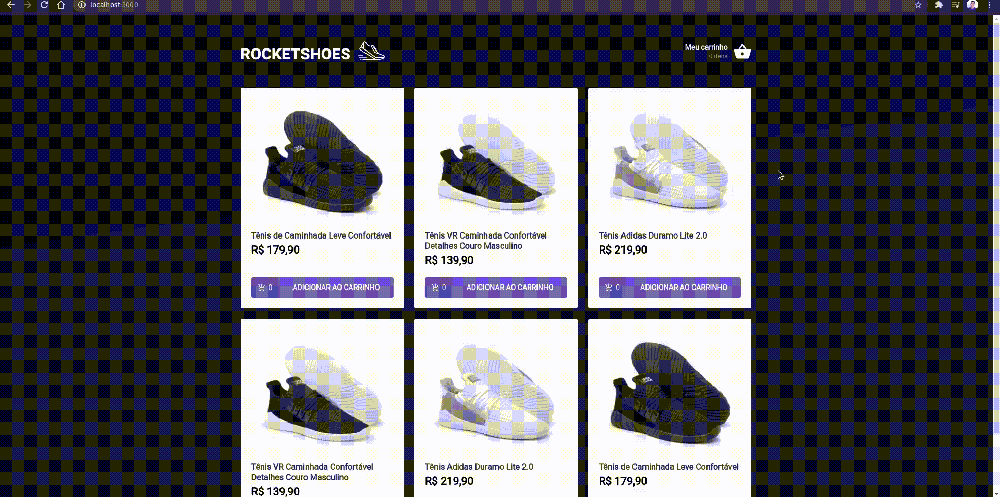
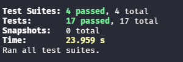

<h1 align="center">
  
</h1>


<h3 align="center">
  RocketShoes - Seu e-commerce esportivo.
</h3>


<p align="center">
  <a href="https://rocketseat.com.br">
    
  </a>
</p>

<p align="center">
 <a href="#-sobre">Sobre</a> |
 <a href="#-requisitos">Requisitos</a> | 
 <a href="#-tecnologias">Tecnologias</a> | 
 <a href="#%EF%B8%8F-como-executar">Como executar</a> | 
 <a href="#-licença">Licença</a> | 
 <a href="#-Testes">Testes</a>
</p>


## 🚀 Sobre
<p align="center">
  
</p>

O RocketShoes é uma aplicação de e-commerce que simula o Netshoes. Foi um desafio proposto pela Rocket do Chapter II da trilha de ReactJS do Bootcamp Ignite com o intuito de desenvolver um projeto para treinar os conhecimentos adquiridos durante o Chapter II. Sendo principalmente o uso de Context API. Nele é possível adicionar um produto, remover, incremetar e decrementar um produto no carrinho. Além disso, apresenta uma mensagem de erro para informar que a quantidade de produto solicitado ultrapassou a quantidade de estoque e também os dados ficam salvos no localstorage.


## 📚 Requisitos
- Ter [**Git**](https://git-scm.com/) para clonar o projeto.

## 🚀 Tecnologias
- [ReactJS](https://github.com/facebook/react)
- [TypeScript](https://github.com/microsoft/TypeScript)
- [Context API](https://pt-br.reactjs.org/docs/context.html#api)
- [Styled Components](https://github.com/styled-components/styled-components)
- [Json Server](https://github.com/typicode/json-server)
- [Axios](https://github.com/axios/axios)
- [React-Toastify](https://github.com/fkhadra/react-toastify)


## ⚙️ Como executar

```bash

    # Clonar o repositório
    $ git clone https://github.com/claudianopl/RocketShoes.git

    # Navegar para o diretório
    $ cd RocketShoes

    # Instalar as package
    $ yarn

    # Rodar o servidor
    $ yarn server

    # Rodar o projeto
    $ yarn start

     # Rodar os testes
    $ yarn test
```


## 🧪 Testes
<h1 align="left">
  
</h1>


## 📝 Licença
Esse projeto está sob a licença MIT. Veja o arquivo [LICENSE](LICENSE.md) para mais detalhes.

---
Feito com 💜 by Claudiano Lima

<p align="right">
  
  &nbsp;&nbsp;&nbsp;&nbsp;&nbsp;&nbsp;
  
</p>
